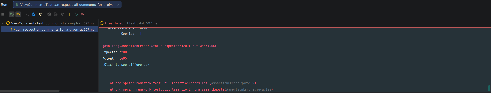
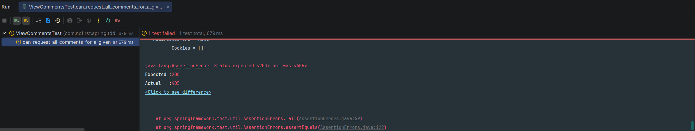

## 本节说明

现在我们已经完成了添加评论的功能，本节我们来实现查看评论的功能。

## 添加测试

依旧从新增测试开始：

*src/test/java/com/nofirst/spring/tdd/zhihu/startup/integration/comments/ViewCommentsTest.java*

```java
package com.nofirst.spring.tdd.zhihu.startup.integration.comments;

import com.fasterxml.jackson.core.type.TypeReference;
import com.fasterxml.jackson.databind.ObjectMapper;
import com.github.pagehelper.PageInfo;
import com.nofirst.spring.tdd.zhihu.startup.common.CommonResult;
import com.nofirst.spring.tdd.zhihu.startup.common.ResultCode;
import com.nofirst.spring.tdd.zhihu.startup.factory.CommentFactory;
import com.nofirst.spring.tdd.zhihu.startup.factory.QuestionFactory;
import com.nofirst.spring.tdd.zhihu.startup.integration.BaseContainerTest;
import com.nofirst.spring.tdd.zhihu.startup.mbg.mapper.AnswerMapper;
import com.nofirst.spring.tdd.zhihu.startup.mbg.mapper.CommentMapper;
import com.nofirst.spring.tdd.zhihu.startup.mbg.mapper.QuestionMapper;
import com.nofirst.spring.tdd.zhihu.startup.mbg.model.AnswerExample;
import com.nofirst.spring.tdd.zhihu.startup.mbg.model.Comment;
import com.nofirst.spring.tdd.zhihu.startup.mbg.model.CommentExample;
import com.nofirst.spring.tdd.zhihu.startup.mbg.model.Question;
import com.nofirst.spring.tdd.zhihu.startup.mbg.model.QuestionExample;
import com.nofirst.spring.tdd.zhihu.startup.model.vo.CommentVo;
import org.junit.jupiter.api.BeforeEach;
import org.junit.jupiter.api.Test;
import org.springframework.beans.factory.annotation.Autowired;
import org.springframework.security.test.context.support.WithUserDetails;

import java.nio.charset.StandardCharsets;
import java.util.List;

import static org.assertj.core.api.Assertions.assertThat;
import static org.springframework.test.web.servlet.request.MockMvcRequestBuilders.get;
import static org.springframework.test.web.servlet.result.MockMvcResultHandlers.print;
import static org.springframework.test.web.servlet.result.MockMvcResultMatchers.status;

class ViewCommentsTest extends BaseContainerTest {

    @Autowired
    private QuestionMapper questionMapper;


    @Autowired
    private AnswerMapper answerMapper;


    @Autowired
    private CommentMapper commentMapper;

    @Autowired
    private ObjectMapper objectMapper;

    @BeforeEach
    public void setupTestData() {

        QuestionExample questionExample = new QuestionExample();
        questionExample.createCriteria();
        questionMapper.deleteByExample(questionExample);

        AnswerExample answerExample = new AnswerExample();
        answerExample.createCriteria();
        answerMapper.deleteByExample(answerExample);

        CommentExample commentExample = new CommentExample();
        commentExample.createCriteria();
        commentMapper.deleteByExample(commentExample);
    }

    @Test
    @WithUserDetails(value = "John", userDetailsServiceBeanName = "customUserDetailsService")
    void can_request_all_comments_for_a_given_question() throws Exception {
        // given
        Question question = QuestionFactory.createPublishedQuestion();
        questionMapper.insert(question);
        List<Comment> comments = CommentFactory.createBatch(40, question.getId(), question.getClass().getSimpleName());
        for (Comment comment : comments) {
            commentMapper.insert(comment);
        }

        // when
        String jsonResponse = this.mockMvc.perform(get("/comments/questions/{questionId}?pageIndex=1&pageSize=20", question.getId()))
                .andDo(print())
                .andExpect(status().isOk())
                .andReturn()
                .getResponse()
                .getContentAsString(StandardCharsets.UTF_8);

        // then
        TypeReference<CommonResult<PageInfo<CommentVo>>> typeRef = new TypeReference<>() {
        };
        CommonResult<PageInfo<CommentVo>> commonResult = objectMapper.readValue(jsonResponse, typeRef);
        long code = commonResult.getCode();
        assertThat(code).isEqualTo(ResultCode.SUCCESS.getCode());

        PageInfo<CommentVo> data = commonResult.getData();

        assertThat(data.getTotal()).isEqualTo(40);
        assertThat(data.getList().size()).isEqualTo(20);
    }
}
```

*src/test/java/com/nofirst/spring/tdd/zhihu/startup/factory/CommentFactory.java*

```java
public class CommentFactory {

    public static Comment create(Integer commentedId, String commentedType) {
        Comment comment = new Comment();
        comment.setUserId(1);
        comment.setCommentedId(commentedId);
        comment.setCommentedType(commentedType);
        Date now = new Date();
        comment.setCreatedAt(now);
        comment.setUpdatedAt(now);
        comment.setContent("just a comment");

        return comment;
    }

    public static List<Comment> createBatch(Integer times, Integer commentedId, String commentedType) {
        List<Comment> comments = new ArrayList<>();
        for (int i = 0; i < times; i++) {
            comments.add(create(commentedId, commentedType));
        }

        return comments;
    }

}
```

*src/main/java/com/nofirst/spring/tdd/zhihu/startup/model/vo/CommentVo.java*

```java
@Data
public class CommentVo {

    private Integer id;

    private Integer commentedId;

    private String content;

    private Date createTime;
}
```

运行测试：



添加相关接口：

*src/main/java/com/nofirst/spring/tdd/zhihu/startup/service/CommentService.java*

```java
package com.nofirst.spring.tdd.zhihu.startup.service;

import com.github.pagehelper.PageInfo;
import com.nofirst.spring.tdd.zhihu.startup.model.dto.CommentDto;
import com.nofirst.spring.tdd.zhihu.startup.model.vo.CommentVo;
import com.nofirst.spring.tdd.zhihu.startup.security.AccountUser;

public interface CommentService {

    void comment(Integer commentedId, String commentedType, CommentDto commentDto, AccountUser accountUser);

    PageInfo<CommentVo> index(Integer commentedId, String commentedType, Integer pageIndex, Integer pageSize);
}
```

*src/main/java/com/nofirst/spring/tdd/zhihu/startup/service/impl/CommentServiceImpl.java*

```java
	.
    .
    .
	@Override
    public PageInfo<CommentVo> index(Integer commentedId, String commentedType, Integer pageIndex, Integer pageSize) {
        PageHelper.startPage(pageIndex, pageSize);
        CommentExample commentExample = new CommentExample();
        CommentExample.Criteria criteria = commentExample.createCriteria();
        criteria.andCommentedIdEqualTo(commentedId);
        criteria.andCommentedTypeEqualTo(commentedType);
        List<Comment> comments = commentMapper.selectByExample(commentExample);
        PageInfo<Comment> commentPageInfo = new PageInfo<>(comments);
        List<CommentVo> result = new ArrayList<>();
        for (Comment comment : comments) {
            CommentVo commentVo = new CommentVo();
            commentVo.setId(comment.getId());
            commentVo.setCommentedId(comment.getCommentedId());
            commentVo.setContent(comment.getContent());
            commentVo.setCreateTime(comment.getCreatedAt());

            result.add(commentVo);
        }
        PageInfo<CommentVo> pageResult = new PageInfo<>();
        pageResult.setTotal(commentPageInfo.getTotal());
        pageResult.setPageNum(commentPageInfo.getPageNum());
        pageResult.setPageSize(commentPageInfo.getPageSize());
        pageResult.setList(result);
        return pageResult;
    }
}
```

*src/main/java/com/nofirst/spring/tdd/zhihu/startup/controller/QuestionCommentsController.java*

```java
.
    .
    .
    @GetMapping("/comments/questions/{questionId}")
    public CommonResult<PageInfo<CommentVo>> index(@PathVariable Integer questionId,
                                                   @RequestParam @NotNull Integer pageIndex,
                                                   @RequestParam @NotNull Integer pageSize) {
                PageInfo<CommentVo> pageInfo = commentService.index(questionId, Question.class.getSimpleName(), pageIndex, pageSize);
        return CommonResult.success(pageInfo);
    }
}
```

再次测试，测试通过。


## 问题下的所有评论

接下来添加新的测试：

```java
    .
    .
    .
    @Test
    void can_request_all_comments_for_a_given_answer() throws Exception {
        // given
        Answer answer = AnswerFactory.createAnswer(1);
        answerMapper.insert(answer);
        List<Comment> comments = CommentFactory.createBatch(40, answer.getId(), answer.getClass().getSimpleName());
        for (Comment comment : comments) {
            commentMapper.insert(comment);
        }

        // when
        String jsonResponse = this.mockMvc.perform(get("/comments/answers/{answerId}?pageIndex=1&pageSize=20", answer.getId()))
                .andDo(print())
                .andExpect(status().isOk())
                .andReturn()
                .getResponse()
                .getContentAsString(StandardCharsets.UTF_8);

        // then
        TypeReference<CommonResult<PageInfo<CommentVo>>> typeRef = new TypeReference<>() {
        };
        CommonResult<PageInfo<CommentVo>> commonResult = objectMapper.readValue(jsonResponse, typeRef);
        long code = commonResult.getCode();
        assertThat(code).isEqualTo(ResultCode.SUCCESS.getCode());

        PageInfo<CommentVo> data = commonResult.getData();

        assertThat(data.getTotal()).isEqualTo(40);
        assertThat(data.getList().size()).isEqualTo(20);
    }

}
```

运行测试：




添加相关接口：

*src/main/java/com/nofirst/spring/tdd/zhihu/startup/controller/AnswerCommentsController.java*

```java
	.
    .
    .
    
    @GetMapping("/comments/answers/{answerId}")
    public CommonResult<PageInfo<CommentVo>> index(@PathVariable Integer answerId,
                                                   @RequestParam @NotNull Integer pageIndex,
                                                   @RequestParam @NotNull Integer pageSize) {
        PageInfo<CommentVo> pageInfo = commentService.index(answerId, Answer.class.getSimpleName(), pageIndex, pageSize);
        return CommonResult.success(pageInfo);
    }
}
```

运行测试，测试通过。

我们已经对评论模型实现了赞同与反对功能，并且在本节开发了查看评论列表的功能，所以接下来我们把是否进行过赞同与反对，已经赞同与反对数量显示出来。新建测试：

*src/test/java/com/nofirst/spring/tdd/zhihu/startup/integration/comments/CommentUpVotesTest.java*

```java
package com.nofirst.spring.tdd.zhihu.startup.integration.comments;

import com.fasterxml.jackson.core.type.TypeReference;
import com.fasterxml.jackson.databind.ObjectMapper;
import com.github.pagehelper.PageInfo;
import com.nofirst.spring.tdd.zhihu.startup.common.CommonResult;
import com.nofirst.spring.tdd.zhihu.startup.factory.CommentFactory;
import com.nofirst.spring.tdd.zhihu.startup.factory.QuestionFactory;
import com.nofirst.spring.tdd.zhihu.startup.integration.AbstractVoteUpTest;
import com.nofirst.spring.tdd.zhihu.startup.mbg.mapper.CommentMapper;
import com.nofirst.spring.tdd.zhihu.startup.mbg.mapper.QuestionMapper;
import com.nofirst.spring.tdd.zhihu.startup.mbg.mapper.VoteMapper;
import com.nofirst.spring.tdd.zhihu.startup.mbg.model.Comment;
import com.nofirst.spring.tdd.zhihu.startup.mbg.model.CommentExample;
import com.nofirst.spring.tdd.zhihu.startup.mbg.model.Question;
import com.nofirst.spring.tdd.zhihu.startup.mbg.model.VoteExample;
import com.nofirst.spring.tdd.zhihu.startup.model.enums.VoteActionType;
import com.nofirst.spring.tdd.zhihu.startup.model.vo.CommentVo;
import com.nofirst.spring.tdd.zhihu.startup.security.CustomUserDetailsService;
import org.junit.jupiter.api.BeforeEach;
import org.junit.jupiter.api.Test;
import org.springframework.beans.factory.annotation.Autowired;
import org.springframework.security.test.context.support.WithUserDetails;

import java.nio.charset.StandardCharsets;
import java.util.List;

import static org.assertj.core.api.Assertions.assertThat;
import static org.springframework.security.test.web.servlet.request.SecurityMockMvcRequestPostProcessors.user;
import static org.springframework.test.web.servlet.request.MockMvcRequestBuilders.get;
import static org.springframework.test.web.servlet.request.MockMvcRequestBuilders.post;
import static org.springframework.test.web.servlet.result.MockMvcResultHandlers.print;
import static org.springframework.test.web.servlet.result.MockMvcResultMatchers.status;

class CommentUpVotesTest extends AbstractVoteUpTest {

    @Autowired
    private VoteMapper voteMapper;
    @Autowired
    private CommentMapper commentMapper;
    @Autowired
    private QuestionMapper questionMapper;

    @Autowired
    private ObjectMapper objectMapper;
    @Autowired
    private CustomUserDetailsService customUserDetailsService;

    @Override
    protected String getResourceTypeName() {
        return Comment.class.getSimpleName();
    }

    @Override
    protected String getResourcePath() {
        return "comments";
    }

    @BeforeEach
    public void setupTestData() {
        VoteExample voteExample = new VoteExample();
        voteExample.createCriteria();
        voteMapper.deleteByExample(voteExample);
        CommentExample commentExample = new CommentExample();
        commentExample.createCriteria();
        commentMapper.deleteByExample(commentExample);
    }

    @Test
    @WithUserDetails(value = "John", userDetailsServiceBeanName = "customUserDetailsService")
    void comment_can_know_it_is_voted_up() throws Exception {
        // given
        Question question = QuestionFactory.createPublishedQuestion();
        questionMapper.insert(question);
        Comment commentWithoutVoting = CommentFactory.create(question.getId(), question.getClass().getSimpleName());
        commentMapper.insert(commentWithoutVoting);
        Comment commentWithVoting = CommentFactory.create(question.getId(), question.getClass().getSimpleName());
        commentMapper.insert(commentWithVoting);
        // vote up
        this.mockMvc.perform(post(getUpVoteUrl(commentWithVoting.getId())));

        // when
        String json = this.mockMvc.perform(get("/comments/questions/{questionId}?pageIndex=1&pageSize=20", question.getId()))
                .andExpect(status().isOk()).andReturn().getResponse()
                .getContentAsString(StandardCharsets.UTF_8);

        // then
        TypeReference<CommonResult<PageInfo<CommentVo>>> typeRef = new TypeReference<>() {
        };
        CommonResult<PageInfo<CommentVo>> pageResult = objectMapper.readValue(json, typeRef);
        List<CommentVo> data = pageResult.getData().getList();
        assertThat(data.size()).isEqualTo(2);

        assertThat(data.get(0).getId()).isEqualTo(commentWithoutVoting.getId());
        assertThat(data.get(0).getVoteType()).isEqualTo(VoteActionType.NOTHING.getCode());

        assertThat(data.get(1).getId()).isEqualTo(commentWithVoting.getId());
        assertThat(data.get(1).getVoteType()).isEqualTo(VoteActionType.VOTE_UP.getCode());

        // 切换到1号用户进行访问
        json = this.mockMvc.perform(get("/comments/questions/{questionId}?pageIndex=1&pageSize=20", question.getId())
                        .with(user(customUserDetailsService.loadUserByUsername("Jane")))
                ).andExpect(status().isOk()).andReturn().getResponse()
                .getContentAsString(StandardCharsets.UTF_8);
        pageResult = objectMapper.readValue(json, typeRef);
        data = pageResult.getData().getList();
        assertThat(data.size()).isEqualTo(2);
        // 对1号用户而言，两条都是没有点过赞的
        assertThat(data.get(0).getId()).isEqualTo(commentWithoutVoting.getId());
        assertThat(data.get(0).getVoteType()).isEqualTo(VoteActionType.NOTHING.getCode());
        assertThat(data.get(1).getId()).isEqualTo(commentWithVoting.getId());
        assertThat(data.get(1).getVoteType()).isEqualTo(VoteActionType.NOTHING.getCode());
    }

    @Test
    @WithUserDetails(value = "John", userDetailsServiceBeanName = "customUserDetailsService")
    void can_know_up_votes_count() throws Exception {
        // given
        Question question = QuestionFactory.createPublishedQuestion();
        questionMapper.insert(question);
        Comment comment = CommentFactory.create(question.getId(), question.getClass().getSimpleName());
        commentMapper.insert(comment);
        // 2号用户 vote up
        this.mockMvc.perform(post(getUpVoteUrl(comment.getId()))).andDo(print());
        // 1号用户 vote up
        this.mockMvc.perform(post(getUpVoteUrl(comment.getId()))
                .with(user(customUserDetailsService.loadUserByUsername("Jane")))).andDo(print());

        // when
        String json = this.mockMvc.perform(get("/comments/questions/{questionId}?pageIndex=1&pageSize=20", question.getId()))
                .andExpect(status().isOk()).andReturn().getResponse()
                .getContentAsString(StandardCharsets.UTF_8);

        // then
        TypeReference<CommonResult<PageInfo<CommentVo>>> typeRef = new TypeReference<>() {
        };
        CommonResult<PageInfo<CommentVo>> pageResult = objectMapper.readValue(json, typeRef);
        List<CommentVo> data = pageResult.getData().getList();
        assertThat(data.size()).isEqualTo(1);
        assertThat(data.get(0).getId()).isEqualTo(comment.getId());
        assertThat(data.get(0).getVoteUpCount()).isEqualTo(2);
    }
}
```

我们一次性添加了2个测试用例，因为我们已经进行过两次相关功能的开发，所以加快点进度倒也无妨。我们修改vo对象：

*src/main/java/com/nofirst/spring/tdd/zhihu/startup/model/vo/CommentVo.java*

```java
@Data
public class CommentVo extends BaseVoteVo {

    private Integer id;

    private Integer commentedId;

    private String content;

    private Date createTime;
}
```

*src/main/java/com/nofirst/spring/tdd/zhihu/startup/service/impl/CommentServiceImpl.java*

```java
@AllArgsConstructor
public class CommentServiceImpl implements CommentService {

    private final CommentMapper commentMapper;
    private final GenericVoteService genericVoteService;
    
    .
    .
    .
    @Override
    public PageInfo<CommentVo> index(Integer commentedId, String commentedType, Integer pageIndex, Integer pageSize, AccountUser accountUser // 这里新加了参数) {
        PageHelper.startPage(pageIndex, pageSize);
        CommentExample commentExample = new CommentExample();
        CommentExample.Criteria criteria = commentExample.createCriteria();
        criteria.andCommentedIdEqualTo(commentedId);
        criteria.andCommentedTypeEqualTo(commentedType);
        List<Comment> comments = commentMapper.selectByExample(commentExample);
        PageInfo<Comment> commentPageInfo = new PageInfo<>(comments);
        List<CommentVo> result = new ArrayList<>();
        for (Comment comment : comments) {
            CommentVo commentVo = new CommentVo();
            commentVo.setId(comment.getId());
            commentVo.setCommentedId(comment.getCommentedId());
            commentVo.setContent(comment.getContent());
            commentVo.setCreateTime(comment.getCreatedAt());

            result.add(commentVo);
        }

        appendVoteType(result, accountUser.getUserId());
        appendVoteCount(result);

        PageInfo<CommentVo> pageResult = new PageInfo<>();
        pageResult.setTotal(commentPageInfo.getTotal());
        pageResult.setPageNum(commentPageInfo.getPageNum());
        pageResult.setPageSize(commentPageInfo.getPageSize());
        pageResult.setList(result);
        return pageResult;
    }


    private void appendVoteCount(List<CommentVo> result) {
        if (CollectionUtils.isEmpty(result)) {
            return;
        }

        genericVoteService.setVoteCounts(result, Comment.class, VoteActionType.VOTE_UP, CommentVo::getId);
        genericVoteService.setVoteCounts(result, Comment.class, VoteActionType.VOTE_DOWN, CommentVo::getId);
    }

    private void appendVoteType(List<CommentVo> result, Integer userId) {
        genericVoteService.setUserVoteTypes(result, Comment.class, userId, CommentVo::getId);
    }
}
```

运行`CommentUpVotesTest`，测试都通过了。继续添加测试：

*src/test/java/com/nofirst/spring/tdd/zhihu/startup/integration/comments/CommentDownVotesTest.java*

```java
package com.nofirst.spring.tdd.zhihu.startup.integration.comments;

import com.fasterxml.jackson.core.type.TypeReference;
import com.fasterxml.jackson.databind.ObjectMapper;
import com.github.pagehelper.PageInfo;
import com.nofirst.spring.tdd.zhihu.startup.common.CommonResult;
import com.nofirst.spring.tdd.zhihu.startup.factory.CommentFactory;
import com.nofirst.spring.tdd.zhihu.startup.factory.QuestionFactory;
import com.nofirst.spring.tdd.zhihu.startup.integration.AbstractVoteDownTest;
import com.nofirst.spring.tdd.zhihu.startup.mbg.mapper.CommentMapper;
import com.nofirst.spring.tdd.zhihu.startup.mbg.mapper.QuestionMapper;
import com.nofirst.spring.tdd.zhihu.startup.mbg.mapper.VoteMapper;
import com.nofirst.spring.tdd.zhihu.startup.mbg.model.Comment;
import com.nofirst.spring.tdd.zhihu.startup.mbg.model.CommentExample;
import com.nofirst.spring.tdd.zhihu.startup.mbg.model.Question;
import com.nofirst.spring.tdd.zhihu.startup.mbg.model.VoteExample;
import com.nofirst.spring.tdd.zhihu.startup.model.enums.VoteActionType;
import com.nofirst.spring.tdd.zhihu.startup.model.vo.CommentVo;
import com.nofirst.spring.tdd.zhihu.startup.security.CustomUserDetailsService;
import org.junit.jupiter.api.BeforeEach;
import org.junit.jupiter.api.Test;
import org.springframework.beans.factory.annotation.Autowired;
import org.springframework.security.test.context.support.WithUserDetails;

import java.nio.charset.StandardCharsets;
import java.util.List;

import static org.assertj.core.api.Assertions.assertThat;
import static org.springframework.security.test.web.servlet.request.SecurityMockMvcRequestPostProcessors.user;
import static org.springframework.test.web.servlet.request.MockMvcRequestBuilders.get;
import static org.springframework.test.web.servlet.request.MockMvcRequestBuilders.post;
import static org.springframework.test.web.servlet.result.MockMvcResultHandlers.print;
import static org.springframework.test.web.servlet.result.MockMvcResultMatchers.status;

class CommentDownVotesTest extends AbstractVoteDownTest {

    @Autowired
    private VoteMapper voteMapper;
    @Autowired
    private CommentMapper commentMapper;
    @Autowired
    private QuestionMapper questionMapper;

    @Autowired
    private ObjectMapper objectMapper;
    @Autowired
    private CustomUserDetailsService customUserDetailsService;

    @Override
    protected String getResourceTypeName() {
        return Comment.class.getSimpleName();
    }

    @Override
    protected String getResourcePath() {
        return "comments";
    }

    @BeforeEach
    public void setupTestData() {
        VoteExample voteExample = new VoteExample();
        voteExample.createCriteria();
        voteMapper.deleteByExample(voteExample);
        CommentExample commentExample = new CommentExample();
        commentExample.createCriteria();
        commentMapper.deleteByExample(commentExample);
    }

    @Test
    @WithUserDetails(value = "John", userDetailsServiceBeanName = "customUserDetailsService")
    void comment_can_know_it_is_voted_down() throws Exception {
        // given
        Question question = QuestionFactory.createPublishedQuestion();
        questionMapper.insert(question);
        Comment commentWithoutVoting = CommentFactory.create(question.getId(), question.getClass().getSimpleName());
        commentMapper.insert(commentWithoutVoting);
        Comment commentWithVoting = CommentFactory.create(question.getId(), question.getClass().getSimpleName());
        commentMapper.insert(commentWithVoting);
        // vote up
        this.mockMvc.perform(post(getDownVoteUrl(commentWithVoting.getId())));

        // when
        String json = this.mockMvc.perform(get("/comments/questions/{questionId}?pageIndex=1&pageSize=20", question.getId()))
                .andExpect(status().isOk()).andReturn().getResponse()
                .getContentAsString(StandardCharsets.UTF_8);

        // then
        TypeReference<CommonResult<PageInfo<CommentVo>>> typeRef = new TypeReference<>() {
        };
        CommonResult<PageInfo<CommentVo>> pageResult = objectMapper.readValue(json, typeRef);
        List<CommentVo> data = pageResult.getData().getList();
        assertThat(data.size()).isEqualTo(2);

        assertThat(data.get(0).getId()).isEqualTo(commentWithoutVoting.getId());
        assertThat(data.get(0).getVoteType()).isEqualTo(VoteActionType.NOTHING.getCode());

        assertThat(data.get(1).getId()).isEqualTo(commentWithVoting.getId());
        assertThat(data.get(1).getVoteType()).isEqualTo(VoteActionType.VOTE_DOWN.getCode());

        // 切换到1号用户进行访问
        json = this.mockMvc.perform(get("/comments/questions/{questionId}?pageIndex=1&pageSize=20", question.getId())
                        .with(user(customUserDetailsService.loadUserByUsername("Jane")))
                ).andExpect(status().isOk()).andReturn().getResponse()
                .getContentAsString(StandardCharsets.UTF_8);
        pageResult = objectMapper.readValue(json, typeRef);
        data = pageResult.getData().getList();
        assertThat(data.size()).isEqualTo(2);
        // 对1号用户而言，两条都是没有点过赞的
        assertThat(data.get(0).getId()).isEqualTo(commentWithoutVoting.getId());
        assertThat(data.get(0).getVoteType()).isEqualTo(VoteActionType.NOTHING.getCode());
        assertThat(data.get(1).getId()).isEqualTo(commentWithVoting.getId());
        assertThat(data.get(1).getVoteType()).isEqualTo(VoteActionType.NOTHING.getCode());
    }

    @Test
    @WithUserDetails(value = "John", userDetailsServiceBeanName = "customUserDetailsService")
    void can_know_up_votes_count() throws Exception {
        // given
        Question question = QuestionFactory.createPublishedQuestion();
        questionMapper.insert(question);
        Comment comment = CommentFactory.create(question.getId(), question.getClass().getSimpleName());
        commentMapper.insert(comment);
        // 2号用户 vote down
        this.mockMvc.perform(post(getDownVoteUrl(comment.getId()))).andDo(print());
        // 1号用户 vote down
        this.mockMvc.perform(post(getDownVoteUrl(comment.getId()))
                .with(user(customUserDetailsService.loadUserByUsername("Jane")))).andDo(print());

        // when
        String json = this.mockMvc.perform(get("/comments/questions/{questionId}?pageIndex=1&pageSize=20", question.getId()))
                .andExpect(status().isOk()).andReturn().getResponse()
                .getContentAsString(StandardCharsets.UTF_8);

        // then
        TypeReference<CommonResult<PageInfo<CommentVo>>> typeRef = new TypeReference<>() {
        };
        CommonResult<PageInfo<CommentVo>> pageResult = objectMapper.readValue(json, typeRef);
        List<CommentVo> data = pageResult.getData().getList();
        assertThat(data.size()).isEqualTo(1);
        assertThat(data.get(0).getId()).isEqualTo(comment.getId());
        assertThat(data.get(0).getVoteDownCount()).isEqualTo(2);
    }
}
```

运行测试，测试都通过了。

## 提交代码

运行全部测试，以保证一切正常。最后，我们提交一下代码：

```
$ git add .
$ git commit -m 'view comment'
```