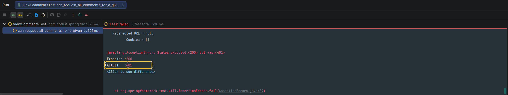

# 查看评论

现在我们已经完成了添加评论的功能，本节我们来实现查看评论的功能。

---

## 一、功能说明

### 1.1 查看评论功能

用户需要能够查看问题或回答下的评论列表。评论列表需要支持分页显示。

### 1.2 开发目标

| 目标 | 说明 |
|------|------|
| 查看问题评论 | 支持分页查询问题下的评论 |
| 查看回答评论 | 支持分页查询回答下的评论 |
| 公开访问 | 查看评论不需要登录 |

---

## 二、查看问题评论

### 2.1 添加测试用例

依旧从新增测试开始：

*src/test/java/com/nofirst/spring/tdd/zhihu/startup/integration/comments/ViewCommentsTest.java*

```java
@TestInstance(TestInstance.Lifecycle.PER_CLASS)
public class ViewCommentsTest extends BaseContainerTest {

    private MockMvc mockMvc;

    @Autowired
    private WebApplicationContext context;

    @Autowired
    private QuestionMapper questionMapper;

    @Autowired
    private AnswerMapper answerMapper;

    @Autowired
    private CommentMapper commentMapper;

    @Autowired
    private ObjectMapper objectMapper;

    @BeforeAll
    public void setup() {
        mockMvc = MockMvcBuilders
                .webAppContextSetup(context)
                .apply(springSecurity())
                .build();
    }

    @BeforeEach
    public void setupTestData() {
        QuestionExample questionExample = new QuestionExample();
        questionExample.createCriteria();
        questionMapper.deleteByExample(questionExample);

        AnswerExample answerExample = new AnswerExample();
        answerExample.createCriteria();
        answerMapper.deleteByExample(answerExample);

        CommentExample commentExample = new CommentExample();
        commentExample.createCriteria();
        commentMapper.deleteByExample(commentExample);
    }

    @Test
    void can_request_all_comments_for_a_given_question() throws Exception {
        // given
        Question question = QuestionFactory.createPublishedQuestion();
        questionMapper.insert(question);
        List<Comment> comments = CommentFactory.createBatch(40, question.getId(), question.getClass().getSimpleName());
        for (Comment comment : comments) {
            commentMapper.insert(comment);
        }

        // when
        String jsonResponse = this.mockMvc.perform(get("/comments/questions/{questionId}?pageIndex=1&pageSize=20", question.getId()))
                .andDo(print())
                .andExpect(status().isOk())
                .andReturn()
                .getResponse()
                .getContentAsString(StandardCharsets.UTF_8);

        // then
        TypeReference<CommonResult<PageInfo<CommentVo>>> typeRef = new TypeReference<>() {
        };
        CommonResult<PageInfo<CommentVo>> commonResult = objectMapper.readValue(jsonResponse, typeRef);
        long code = commonResult.getCode();
        assertThat(code).isEqualTo(ResultCode.SUCCESS.getCode());

        PageInfo<CommentVo> data = commonResult.getData();

        assertThat(data.getTotal()).isEqualTo(40);
        assertThat(data.getList().size()).isEqualTo(20);
    }
}
```

### 2.2 添加工厂类

*src/test/java/com/nofirst/spring/tdd/zhihu/startup/factory/CommentFactory.java*

```java
public class CommentFactory {

    public static Comment create(Integer commentedId, String commentedType) {
        Comment comment = new Comment();
        comment.setUserId(1);
        comment.setCommentedId(commentedId);
        comment.setCommentedType(commentedType);
        Date now = new Date();
        comment.setCreatedAt(now);
        comment.setUpdatedAt(now);
        comment.setContent("just a comment");

        return comment;
    }

    public static List<Comment> createBatch(Integer times, Integer commentedId, String commentedType) {
        List<Comment> comments = new ArrayList<>();
        for (int i = 0; i < times; i++) {
            comments.add(create(commentedId, commentedType));
        }

        return comments;
    }

}
```

### 2.3 创建 CommentVo

*src/main/java/com/nofirst/spring/tdd/zhihu/startup/model/vo/CommentVo.java*

```java
@Data
public class CommentVo {

    private Integer id;

    private Integer commentedId;

    private String content;

    private Date createTime;
}
```

### 2.4 运行测试

运行测试：



### 2.5 放开访问限制

查看评论不需要登录，所以我们放开接口的限制：

*src/main/java/com/nofirst/spring/tdd/zhihu/startup/config/SecurityConfig.java*

```java
.requestMatchers(HttpMethod.GET, "/questions").permitAll()
.requestMatchers(HttpMethod.GET, "/comments/**").permitAll()
```

### 2.6 添加接口

再次测试：


添加相关接口：

*src/main/java/com/nofirst/spring/tdd/zhihu/startup/controller/QuestionCommentsController.java*

```java
@GetMapping("/comments/questions/{questionId}")
public CommonResult<PageInfo<CommentVo>> index(@PathVariable Integer questionId,
                                               @RequestParam @NotNull Integer pageIndex,
                                               @RequestParam @NotNull Integer pageSize) {
        PageInfo<CommentVo> pageInfo = questionCommentService.index(questionId, pageIndex, pageSize);
        return CommonResult.success(pageInfo);
}
```

### 2.7 实现 Service

*src/main/java/com/nofirst/spring/tdd/zhihu/startup/service/impl/QuestionCommentServiceImpl.java*

```java
@Override
public PageInfo<CommentVo> index(Integer questionId, Integer pageIndex, Integer pageSize) {
    PageHelper.startPage(pageIndex, pageSize);
    CommentExample commentExample = new CommentExample();
    CommentExample.Criteria criteria = commentExample.createCriteria();
    criteria.andCommentedIdEqualTo(questionId);
    criteria.andCommentedTypeEqualTo(Question.class.getSimpleName());
    List<Comment> comments = commentMapper.selectByExample(commentExample);
    PageInfo<Comment> commentPageInfo = new PageInfo<>(comments);
    List<CommentVo> result = new ArrayList<>();
    for (Comment comment : comments) {
        CommentVo commentVo = new CommentVo();
        commentVo.setId(comment.getId());
        commentVo.setCommentedId(comment.getCommentedId());
        commentVo.setContent(comment.getContent());
        commentVo.setCreateTime(comment.getCreatedAt());

        result.add(commentVo);
    }
    PageInfo<CommentVo> pageResult = new PageInfo<>();
    pageResult.setTotal(commentPageInfo.getTotal());
    pageResult.setPageNum(commentPageInfo.getPageNum());
    pageResult.setPageSize(commentPageInfo.getPageSize());
    pageResult.setList(result);
    return pageResult;
}
```

### 2.8 运行测试

再次测试，测试通过。

---

## 三、查看回答评论

### 3.1 添加测试用例

接下来添加新的测试：

```java
@Test
void can_request_all_comments_for_a_given_answer() throws Exception {
    // given
    Answer answer = AnswerFactory.createAnswer(1);
    answerMapper.insert(answer);
    List<Comment> comments = CommentFactory.createBatch(40, answer.getId(), answer.getClass().getSimpleName());
    for (Comment comment : comments) {
        commentMapper.insert(comment);
    }

    // when
    String jsonResponse = this.mockMvc.perform(get("/comments/answers/{answerId}?pageIndex=1&pageSize=20", answer.getId()))
            .andDo(print())
            .andExpect(status().isOk())
            .andReturn()
            .getResponse()
            .getContentAsString(StandardCharsets.UTF_8);

    // then
    TypeReference<CommonResult<PageInfo<CommentVo>>> typeRef = new TypeReference<>() {
    };
    CommonResult<PageInfo<CommentVo>> commonResult = objectMapper.readValue(jsonResponse, typeRef);
    long code = commonResult.getCode();
    assertThat(code).isEqualTo(ResultCode.SUCCESS.getCode());

    PageInfo<CommentVo> data = commonResult.getData();

    assertThat(data.getTotal()).isEqualTo(40);
    assertThat(data.getList().size()).isEqualTo(20);
}
```

### 3.2 运行测试

运行测试：


### 3.3 添加接口

添加相关接口：

*src/main/java/com/nofirst/spring/tdd/zhihu/startup/controller/AnswerCommentsController.java*

```java
@GetMapping("/comments/answers/{answerId}")
public CommonResult<PageInfo<CommentVo>> index(@PathVariable Integer answerId,
                                               @RequestParam @NotNull Integer pageIndex,
                                               @RequestParam @NotNull Integer pageSize) {
    PageInfo<CommentVo> pageInfo = answerCommentService.index(answerId, pageIndex, pageSize);
    return CommonResult.success(pageInfo);
}
```

### 3.4 实现 Service

*src/main/java/com/nofirst/spring/tdd/zhihu/startup/service/impl/AnswerCommentServiceImpl.java*

```java
@Override
public PageInfo<CommentVo> index(Integer answerId, Integer pageIndex, Integer pageSize) {
    PageHelper.startPage(pageIndex, pageSize);
    CommentExample commentExample = new CommentExample();
    CommentExample.Criteria criteria = commentExample.createCriteria();
    criteria.andCommentedIdEqualTo(answerId);
    criteria.andCommentedTypeEqualTo(Answer.class.getSimpleName());
    List<Comment> comments = commentMapper.selectByExample(commentExample);
    PageInfo<Comment> commentPageInfo = new PageInfo<>(comments);
    List<CommentVo> result = new ArrayList<>();
    for (Comment comment : comments) {
        CommentVo commentVo = new CommentVo();
        commentVo.setId(comment.getId());
        commentVo.setCommentedId(comment.getCommentedId());
        commentVo.setContent(comment.getContent());
        commentVo.setCreateTime(comment.getCreatedAt());

        result.add(commentVo);
    }
    PageInfo<CommentVo> pageResult = new PageInfo<>();
    pageResult.setTotal(commentPageInfo.getTotal());
    pageResult.setPageNum(commentPageInfo.getPageNum());
    pageResult.setPageSize(commentPageInfo.getPageSize());
    pageResult.setList(result);
    return pageResult;
}
```

### 3.5 运行测试

运行测试，测试通过。

### 3.6 运行全部测试

运行全部测试，以保证一切正常。

---

## 四、提交代码

最后，我们提交一下代码：

```bash
$ git add .
$ git commit -m 'view comment'
```

---

## 五、总结

### 5.1 本节学习要点

| 要点 | 说明 |
|------|------|
| 分页查询 | 使用 PageHelper 实现评论分页 |
| 公开访问 | 评论列表接口不需要登录 |
| 多态查询 | 根据 `commented_type` 查询不同类型 |

### 5.2 评论列表接口

| 功能 | 接口 | 说明 |
|------|------|------|
| 查看问题评论 | `GET /comments/questions/{id}` | 分页查询问题评论 |
| 查看回答评论 | `GET /comments/answers/{id}` | 分页查询回答评论 |

---

## 六、下一步

查看评论功能已完成，请继续阅读：

1. [艾特某人](./5.艾特某人.md) - 实现@用户通知功能
2. [小结](./6.小结.md) - 本章总结

---

## 附录：CommentVo 字段

```java
@Data
public class CommentVo {

    private Integer id;           // 评论 ID
    private Integer commentedId;  // 被评论对象 ID
    private String content;       // 评论内容
    private Date createTime;      // 创建时间
}
```
